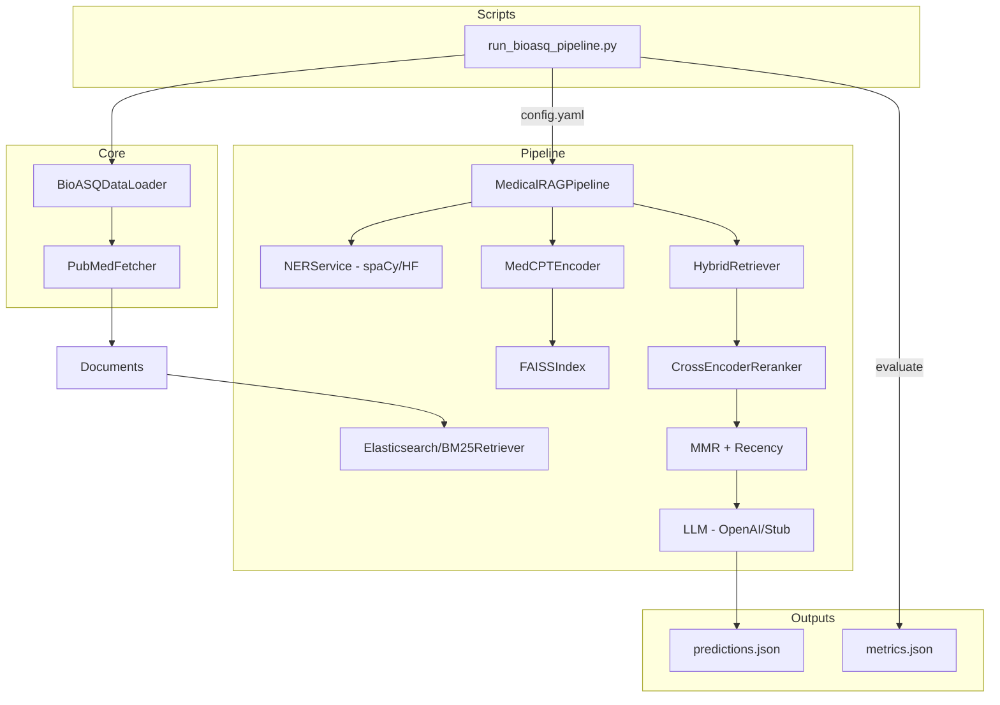

# Medical RAG System

A comprehensive Retrieval-Augmented Generation (RAG) system for medical question answering, combining biomedical NER, dense/sparse retrieval, cross-encoder reranking, MMR diversity, and LLM generation.

## 🏗️ Architecture

The pipeline follows this flow:

1. **Query Processing** → Text normalization and NER entity extraction
2. **PubMed Lookup** → Query PubMed APIs using extracted entities
3. **Encoding** → Generate embeddings with MedCPT encoder
4. **Retrieval** → Hybrid retrieval (FAISS + BM25/Elasticsearch)
5. **Reranking** → Cross-encoder reranking with S-PubMedBERT
6. **MMR** → Maximal Marginal Relevance for diversity and recency
7. **Generation** → LLM answer generation with citations
8. **Evaluation** → Retrieval metrics and answer quality assessment

### Diagram



## 📁 Project Structure

```
medical_rag_system/
├── .github/workflows/     # CI/CD configuration
├── docs/                  # Documentation (HTML + conversion scripts)
├── docker/                # Dockerfiles and compose
├── configs/               # Pipeline configuration
├── scripts/               # Build and run scripts
├── src/                   # Source code
│   ├── api/              # FastAPI application
│   ├── core/             # Core utilities (normalizer, MMR)
│   ├── ner/              # Named entity recognition
│   ├── retrieval/        # FAISS, BM25, hybrid retrieval
│   ├── reranker/         # Cross-encoder reranking
│   ├── encoder/          # Encoders (MedCPT, BioBERT)
│   ├── llm/              # LLM clients (OpenAI, stub)
│   └── pipeline/         # Main RAG pipeline orchestration
├── evaluation/           # Evaluation scripts and notebooks
├── tests/                # Unit and integration tests
├── data/                 # Sample data (docs.jsonl)
└── runs/                 # Generated artifacts (gitignored)
```

## 🚀 Quick Start

### Prerequisites

Install system dependencies (see `sys_requirements.txt`):
- Python 3.12 (recommended). Use Python 3.11 if you prefer SciSpaCy.
- Docker (for Elasticsearch)
- wkhtmltopdf or Chrome (optional, for PDF generation)

### Installation

```bash
# Clone the repository
cd medical_rag_system

# Install Python dependencies
pip install -r requirements.txt

# Set up environment variables
export OPENAI_API_KEY="your-api-key"
export LLM_PROVIDER="openai"  # or "stub" for testing

# (Optional) Choose a spaCy model instead of the default HF NER
# python -m pip install "https://github.com/explosion/spacy-models/releases/download/en_core_web_sm-3.7.1/en_core_web_sm-3.7.1-py3-none-any.whl"
```

### Running with Docker

```bash
# Start services (Elasticsearch, FAISS, API)
cd docker
docker compose up -d

# Check service status
docker compose ps
```

### Running the Pipeline

```bash
# Make scripts executable
chmod +x scripts/run_pipeline.sh

# Run the pipeline
./scripts/run_pipeline.sh configs/pipeline_config.yaml

# Or run individual steps
python scripts/encode_documents.py --config configs/pipeline_config.yaml --output-dir runs/test-run
python scripts/build_faiss_index.py --embeddings runs/test-run/embeddings.npy --output runs/test-run/faiss.index
python scripts/ingest_elastic.py --config configs/pipeline_config.yaml --docs data/docs.jsonl
```

### Encoders: MedCPT vs BioBERT

You can switch between encoders via `configs/pipeline_config.yaml` under the `encoder` section:

- **MedCPT (default):**
  - `encoder.backend: "medcpt"`
  - `encoder.model: "ncbi/MedCPT-Query-Encoder"`

- **BioBERT:**
  - `encoder.backend: "biobert"`
  - `encoder.model: "dmis-lab/biobert-base-cased-v1.1"` (or a compatible PubMedBERT model like `microsoft/BiomedNLP-PubMedBERT-base-uncased-abstract`) 

Example snippet:

```yaml
encoder:
  backend: "biobert"
  model: "dmis-lab/biobert-base-cased-v1.1"
  embedding_dim: 768
  batch_size: 32
  device: "cuda"
```

Run commands are unchanged; the pipeline will instantiate the selected encoder:

```bash
python scripts/run_bioasq_pipeline.py --round 1 --email jgibson2@andrew.cmu.edu --config configs/pipeline_config.yaml --output results/round_1
```

### BioBERT Retriever Pipeline

Use the dedicated BioBERT dense retriever pipeline to produce separate outputs:

```bash
python scripts/run_bioasq_pipeline_biobert.py \
  --round 1 \
  --email jgibson2@andrew.cmu.edu \
  --config configs/pipeline_config.yaml \
  --data-dir data/bioasq \
  --output results \
  --max-questions 10
```

Outputs are saved to:
- `results/round_1/predictions_biobert.json`
- `results/round_1/metrics_biobert.json`

### Hybrid MedCPT + BM25 Pipeline

Run the MedCPT dense + BM25 sparse hybrid retriever variant:

```bash
python scripts/run_bioasq_pipeline_hybrid_medcpt.py \
  --round 1 \
  --email jgibson2@andrew.cmu.edu \
  --config configs/pipeline_config.yaml \
  --data-dir data/bioasq \
  --output results \
  --max-questions 10
```

Outputs are saved to:
- `results/round_1/predictions_hybrid_medcpt.json`
- `results/round_1/metrics_hybrid_medcpt.json`

Notes:
- Both encoders produce 768-d embeddings and use CLS token pooling.
- If the HF model fails to load, the pipeline falls back to placeholder random embeddings (for dev/testing).
- Performance and retrieval quality may differ; compare metrics under `results/round_X/metrics.json`.

### NER Backends

By default, the pipeline uses a Hugging Face token-classification model for biomedical NER (set in `configs/pipeline_config.yaml` under `ner.model`).

- Default (Python 3.12 friendly):
  - `ner.model: "hf:d4data/biomedical-ner-all"` (no extra install steps)
- Optional spaCy model:
  - Install a compatible model and set `ner.model: "en_core_web_sm"`
  - `python -m pip install "https://github.com/explosion/spacy-models/releases/download/en_core_web_sm-3.7.1/en_core_web_sm-3.7.1-py3-none-any.whl"`
- Optional SciSpaCy (requires Python 3.11):
  - `pip install "scipy==1.10.1" "spacy==3.7.2" "scispacy==0.5.4"`
  - `pip install https://github.com/allenai/scispacy/releases/download/v0.5.4/en_core_sci_sm-0.5.4.tar.gz`
  - Set `ner.model: "en_core_sci_sm"`

### Running the API

```bash
# Start the FastAPI server
uvicorn src.api.app:app --host 0.0.0.0 --port 8000 --reload

# Query the API
curl -X POST "http://localhost:8000/query" \
  -H "Content-Type: application/json" \
  -d '{"query": "What are the symptoms of COVID-19?", "top_k": 10}'
```

## 🧪 Testing

```bash
# Run unit tests
pytest tests/unit -v

# Run integration tests
pytest tests/integration -v

# Run all tests with coverage
pytest tests/ --cov=src --cov-report=html
```

## 📊 Evaluation

Use the evaluation notebook:

```bash
cd evaluation/evaluation_QA_system
jupyter notebook evaluation_pipeline.ipynb
```

## ⚙️ Configuration

Edit `configs/pipeline_config.yaml` to customize:

- Model selections (encoder, reranker, LLM)
- NER backend (`ner.model`), e.g., HF model or spaCy package
- Retrieval parameters (top_k, hybrid weights)
- MMR settings (lambda, recency weight)
- Temporal strategies (recency boost, time buckets)
- LLM configuration (temperature, max tokens)

## 🔄 CI/CD

GitHub Actions workflow (`.github/workflows/ci.yml`) runs on every push:

1. Linting with flake8
2. Unit tests
3. Integration smoke tests
4. Artifact collection (manifests, results)

The CI uses a stub LLM to avoid external API calls.

## 📝 Reproducibility

Every pipeline run generates:

- `run_manifest.json` — Git SHA, model versions, seeds, checksums
- `embeddings_manifest.json` — Encoder details, data hashes
- `results.jsonl` — Query results with retrieved documents
- `faiss.index` — Vector index snapshot

## 🛠️ Development

### Adding New Components

1. Create module in `src/<component>/`
2. Add tests in `tests/unit/` or `tests/integration/`
3. Update `configs/pipeline_config.yaml` if needed
4. Update this README

### Code Style

```bash
# Run linter
flake8 src/ tests/

# Format code (optional)
black src/ tests/
```

